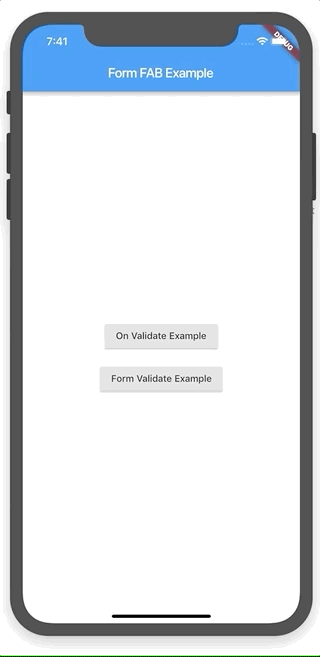

# form_floating_action_button

A pure Dart Flutter plugin to add some basic form functionality to the Floating
Action Button.

## Demo



## Installation

Add to `pubspec.yaml`

```yaml
dependencies:
  ...
  form_floating_action_button: any
```

## Usage Example

Import `form_floating_action_button.dart`

```dart
import 'package:form_floating_action_button/form_floating_action_button.dart';
```

### Usage within a `Form`

```dart
Widget build(BuildContext context) {
  return Form(
    child: Scaffold(
      appBar: AppBar(
        title: Text('Form Validate'),
      ),
      body: Material(
        child: ListView(
          children: <Widget>[
            Padding(
              padding: EdgeInsets.symmetric(horizontal: 16.0),
              child: TextFormField(
                decoration: InputDecoration(
                  labelText: 'Email',
                ),
                onFieldSubmitted: (_) {
                  _controller.firePressed();
                },
                validator: (value) {
                  String error;
                  if (value?.isNotEmpty != true) {
                    error = 'Email is required';
                  } else if (value.contains('@') != true ||
                      value.contains('.') != true) {
                    error = 'Email is not valid';
                  }

                  return error;
                },
              ),
            ),
          ],
        ),
      ),
      floatingActionButton: FormFloatingActionButton(
        controller: _controller,
        loading: _loading,
        onSubmit: () {
          setState(() => _loading = true);
          Future.delayed(Duration(seconds: 5)).then((_) {
            if (mounted) {
              setState(() {
                _loading = false;
              });
            }
          });
        },
      ),
    ),
  );
}
```

### Custom On Validate

```dart
@override
Widget build(BuildContext context) {
  return Scaffold(
    appBar: AppBar(
      title: Text('On Validate'),
    ),
    body: Material(
      child: ListView(
        children: <Widget>[
          ListTile(
            onTap: () {
              setState(() => _validateSuccess = !_validateSuccess);
            },
            title: Text('Validation Successful'),
            trailing: IgnorePointer(
              child: Switch(
                value: _validateSuccess,
                onChanged: (_) {},
              ),
            ),
          )
        ],
      ),
    ),
    floatingActionButton: FormFloatingActionButton(
      loading: _loading,
      onSubmit: () {
        setState(() => _loading = true);
        Future.delayed(Duration(seconds: 5)).then((_) {
          if (mounted) {
            setState(() {
              _loading = false;
            });
          }
        });
      },
      onValidate: () {
        return Future.value(_validateSuccess);
      },
    ),
  );
}
```
